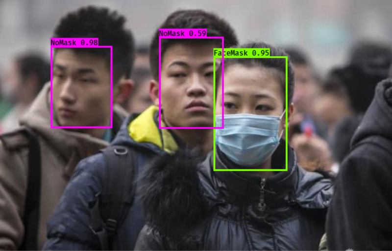

# Keras Yolo-v3 口罩检测 Face Mask Detection

[](LICENSE)

## 模型来源/Trained Model From

###[DataXujing/DIoU_YOLO_V3](https://github.com/DataXujing/DIoU_YOLO_V3)

####转换为Keras格式方便移植到ONNX, TF-Lite等。
####Convert original darknet weight to Keras format, more convenient to porting to edge devices.

##使用步骤/Usage

- 转换权重 Weight format conversion

```
# Download pretrained darknet weight from https://github.com/DataXujing/DIoU_YOLO_V3/releases/tag/Mask_model
python convert.py myData-ciou.cfg myData-ciou_21000.weights model_data\facemask.h5
```

- 调用测试 Inference

```
python yolo_video.py --image
```

